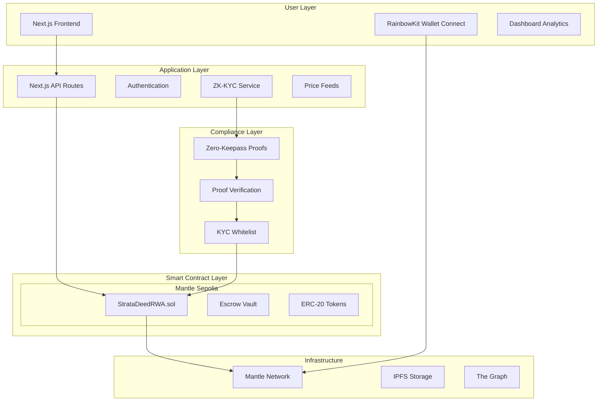

# StrataDeed

> **Privacy-Preserving RealFi Platform on Mantle Network**  
> *Bringing $300T Real Estate Onchain with Zero-Knowledge Compliance*

[](https://www.mantle.xyz/)
[](https://nextjs.org/)
[](https://hardhat.org/)
[](https://getfoundry.sh/)
[](LICENSE)
[](https://mantle.xyz/ecosystem/hackathon)

## Demo Video & Live App
**Video Demo**: [Watch 3-Minute Walkthrough]()  
**Live Demo**: [Try StrataDeed](https://strata-deed.vercel.app)  
**Smart Contracts**: [Mantle Sepolia Explorer](https://explorer.sepolia.mantle.xyz/address/0x1983D02fDbD7fDBae10031598C363C55B3826C72)

---

## Table of Contents
- [The Vision](#the-vision)
- [Architecture](#architecture)
- [ZK-KYC Innovation](#zk-kyc-innovation)
- [Quick Start (30s)](#quick-start-30s)
- [Detailed Setup](#detailed-setup)
- [Marketplace Features](#marketplace-features)
- [User Flows](#user-flows)
- [Tech Stack Deep Dive](#tech-stack-deep-dive)
- [Mantle Integration](#mantle-integration)
- [Roadmap & Vision](#roadmap--vision)
- [Hackathon Notes](#hackathon-notes)
- [Contributing](#contributing)
- [License](#license)

---

## The Vision

**StrataDeed transforms illiquid real estate into liquid, accessible digital assets while preserving privacy and compliance.** We're building the first RealFi platform that balances institutional requirements with DeFi accessibility.

### The Problem We Solve
| Problem | Traditional Solution | **StrataDeed's Solution** |
|---------|---------------------|--------------------------|
| **High Entry Barrier** | $50k+ minimum investments | **Fractional ownership from $100** |
| **Illiquidity** | 30-60 day settlements | **24/7 trading on Mantle L2** |
| **Privacy vs Compliance** | Choose one or the other | **ZK-KYC: Compliant yet private** |
| **Paperwork & Middlemen** | Lawyers, brokers, banks | **Smart contracts automate everything** |
| **Geographic Barriers** | Local investors only | **Global access via blockchain** |

### Our Core Innovation
1. **ERC-20 Tokenization** with built-in compliance hooks
2. **ZK-ready KYC verification** (future: full ZK proofs)
3. **Escrow vaults** for secure fund management
4. **Mantle-optimized** for low fees & high throughput
5. **Professional dashboard** for institutional-grade management

---


1. **Real-World Impact**: Targets $300T real estate market vs niche crypto use cases
2. **Technical Depth**: Full stack - contracts + frontend + ZK roadmap
3. **Mantle-Specific**: Leverages Mantle's low fees for fractional microtransactions
4. **Regulation-First**: Designed for real adoption, not just crypto-native users
5. **Complete Solution**: From minting -> marketplace -> dashboard -> compliance

- **RealFi Focus**: Directly addresses Mantle's real-world assets initiative
- **Scalability Showcase**: Demonstrates Mantle's L2 advantages for microtransactions
- **Modular Future**: Architecture ready for Mantle's data availability layer
- **Ecosystem Growth**: Creates new use cases for $MNT token

---

## Architecture

### System Overview


## ZK-KYC Innovation

StrataDeed implements a privacy-first approach to compliance.

*   **Credential Hashing**: User credentials are hashed off-chain.
*   **Zero-Knowledge Proofs**: Only the proof of compliance is submitted on-chain.
*   **Selective Disclosure**: Users can prove they are eligible investors without revealing their exact identity or location.

## Quick Start (30s)

1.  **Clone**: `git clone https://github.com/Vheek10/stratadeed.git`
2.  **Install**: `pnpm install` (or `npm install`)
3.  **Setup Env**: Copy `.env.example` to `.env.local` and configure keys.
4.  **Run**: `pnpm dev`
5.  **Open**: `http://localhost:3000`

## Detailed Setup

### Prerequisites

*   Node.js v20+
*   MetaMask (configured for Mantle Sepolia)
*   pnpm (recommended) or npm

### Environment Variables

Copy `.env.example` to `.env.local` and add:

```bash
NEXT_PUBLIC_WALLET_CONNECT_PROJECT_ID=...
PRIVATE_KEY=...
```

## Tech Stack Deep Dive

*   **Frontend**: Next.js 16 (App Router), React 19, Tailwind CSS 4
*   **Smart Contracts**: Solidity 0.8.24, Hardhat, Foundry
*   **Web3**: Wagmi v3, Viem, RainbowKit
*   **Network**: Mantle Sepolia Testnet

## Mantle Integration

We utilize Mantle's unique features:

*   **Low Gas Fees**: Enabling micro-investments in real estate.
*   **Fast Finality**: Instant settlement for secondary market trades.

## Contributing

1.  Fork the repo
2.  Create feature branch
3.  Commit changes
4.  Push to branch
5.  Create Pull Request

## License

MIT License.

> **Privacy-Preserving RealFi Platform on Mantle Network**  
> *Bringing $300T Real Estate Onchain with Zero-Knowledge Compliance*

[](https://www.mantle.xyz/)
[](https://nextjs.org/)
[](https://hardhat.org/)
[](LICENSE)
[](https://mantle.xyz/ecosystem/hackathon)

## Demo Video & Live App
**Video Demo**: [Watch 3-Minute Walkthrough]()  
**Live Demo**: [Try StrataDeed](https://strata-deed.vercel.app)  
**Smart Contracts**: [Mantle Sepolia Explorer](https://explorer.sepolia.mantle.xyz/address/0x1983D02fDbD7fDBae10031598C363C55B3826C72)

---

## Table of Contents
- [The Vision](#the-vision)
- [Architecture](#architecture)
- [ZK-KYC Innovation](#zk-kyc-innovation)
- [Quick Start (30s)](#quick-start-30s)
- [Detailed Setup](#detailed-setup)
- [Marketplace Features](#marketplace-features)
- [User Flows](#user-flows)
- [Tech Stack Deep Dive](#tech-stack-deep-dive)
- [Mantle Integration](#mantle-integration)
- [Roadmap & Vision](#roadmap--vision)
- [Hackathon Notes](#hackathon-notes)
- [Contributing](#contributing)
- [License](#license)

---

## The Vision

**StrataDeed transforms illiquid real estate into liquid, accessible digital assets while preserving privacy and compliance.** We're building the first RealFi platform that balances institutional requirements with DeFi accessibility.

### The Problem We Solve
| Problem | Traditional Solution | **StrataDeed's Solution** |
|---------|---------------------|--------------------------|
| **High Entry Barrier** | $50k+ minimum investments | **Fractional ownership from $100** |
| **Illiquidity** | 30-60 day settlements | **24/7 trading on Mantle L2** |
| **Privacy vs Compliance** | Choose one or the other | **ZK-KYC: Compliant yet private** |
| **Paperwork & Middlemen** | Lawyers, brokers, banks | **Smart contracts automate everything** |
| **Geographic Barriers** | Local investors only | **Global access via blockchain** |

### Our Core Innovation
1. **ERC-20 Tokenization** with built-in compliance hooks
2. **ZK-ready KYC verification** (future: full ZK proofs)
3. **Escrow vaults** for secure fund management
4. **Mantle-optimized** for low fees & high throughput
5. **Professional dashboard** for institutional-grade management

---


1. **Real-World Impact**: Targets $300T real estate market vs niche crypto use cases
2. **Technical Depth**: Full stack - contracts + frontend + ZK roadmap
3. **Mantle-Specific**: Leverages Mantle's low fees for fractional microtransactions
4. **Regulation-First**: Designed for real adoption, not just crypto-native users
5. **Complete Solution**: From minting -> marketplace -> dashboard -> compliance

- **RealFi Focus**: Directly addresses Mantle's real-world assets initiative
- **Scalability Showcase**: Demonstrates Mantle's L2 advantages for microtransactions
- **Modular Future**: Architecture ready for Mantle's data availability layer
- **Ecosystem Growth**: Creates new use cases for $MNT token

---

## Architecture

### System Overview


## ZK-KYC Innovation

StrataDeed implements a privacy-first approach to compliance.

*   **Credential Hashing**: User credentials are hashed off-chain.
*   **Zero-Knowledge Proofs**: Only the proof of compliance is submitted on-chain.
*   **Selective Disclosure**: Users can prove they are eligible investors without revealing their exact identity or location.

## Quick Start (30s)

1.  **Clone**: `git clone https://github.com/Vheek10/stratadeed.git`
2.  **Install**: `npm install`
3.  **Run**: `npm run dev`
4.  **Open**: `http://localhost:3000`

## Detailed Setup

### Prerequisites

*   Node.js v20+
*   MetaMask (configured for Mantle Sepolia)

### Environment Variables

Copy `.env.example` to `.env.local` and add:

```bash
NEXT_PUBLIC_WALLET_CONNECT_PROJECT_ID=...
PRIVATE_KEY=...
```

## Tech Stack Deep Dive

*   **Frontend**: Next.js 16 (App Router), React 19, Tailwind CSS 4
*   **Smart Contracts**: Solidity 0.8.20, Hardhat, Foundry
*   **Web3**: Wagmi v3, Viem, RainbowKit
*   **Network**: Mantle Sepolia Testnet

## Mantle Integration

We utilize Mantle's unique features:

*   **Low Gas Fees**: Enabling micro-investments in real estate.
*   **Fast Finality**: Instant settlement for secondary market trades.

## Contributing

1.  Fork the repo
2.  Create feature branch
3.  Commit changes
4.  Push to branch
5.  Create Pull Request

## License

MIT License.
